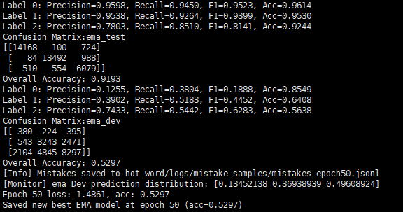

# Introducing FixMatch semi-supervised learning to fine-tune model downstream task training

## Motivation

When training models for downstream business tasks (here focused on NLP, but extendable to other domains), you often need to process large amounts of domain-specific data. 

Labeling this data can be challenging, even though unlabeled data may be abundant. 

This project aims to provide ideas and methods for efficiently fine-tuning models using such data, making it easier to leverage unlabeled datasets while addressing domain-specific needs.

## Notes

- The original dataset is **not provided**, as it is company-private.  
- The model may **not generalize well** to real-world data distributions. This project aims to provide ideas and methods for fine-tuning, rather than production-ready results.

## Step 1: Prepare Dataset
The project root directory is structured as follows:
```angular2html
project/
├─ hot_word/
│ └─ Dataset/
│ └─ P1_data/
│ ├─ Dev/ # Validation set
│ ├─ labeled/ # Labeled training data
│ └─ unlabeled/ # Unlabeled training data
├─ model_test/ # Pre-trained models
```

** Instructions:**

1. Place your training and validation data in the corresponding folders under `hot_word/Dataset/P1_data/` .
  - `Dev/` : Validation set for monitoring performance.
  - `labeled/` : Labeled data for fine-tuning.
  - `unlabeled/` : Unlabeled data that can be used for semi-supervised methods or other experiments.

2. The test set can be **split from the labeled data** as needed.

3. Each folder can contain **any number of files**, but they **must be CSV files**. If you want to use other formats, you need to modify the `LabeledDataset` and `UnlabeledDataset` classes in the training code accordingly.

4. CSV files must have **exactly two columns**:
   - For labeled data: the **first column** is text, the **second column** is the label.
   - For unlabeled data: only the **first column** (text) is used; the second column is ignored if present.
   - Column names (headers) are **not required**; the code will skip the first row as header by default.

## Step 2: Fine-tuning / Training

### Directory Strcture

```angular2html
project/
├─ hot_word/
│ ├─ Model_train/
│ │ ├─ P1_FixMatch.py # Standard training script
│ │ └─ P1_FixMatch_Advanced.py # Advanced version with additional features
│ └─ config/
│ └─ config.yaml # Example YAML configuration
├─ model_test/
│ └─ pretrain_models/
│ └─ chinese-roberta-wwm-ext/ # Example pre-trained model
└─ logs/ # Log files can be configured in YAML
```

### Training Scripts

- `P1_FixMatch.py`: Standard training script.
- `P1_FixMatch_Advanced.py`: Advanced version with additional features, including:
  - Partial layer freezing / unfreezing strategy
  - Dropout variations
  - Inference threshold for pseudo-labeling
  - Pseudo-label quota handling based on predicted class ratios (`pos_ratio`, `neg_ratio`, `neutral-ratio`) to avoid batches dominated by neutral labels
  - Different strong augmentation strengths for preudo-labels based on predicted class (larger for neutral, smaller for positive/negative)
  - Weighted cross-entropy loss
  - Improved monitoring of label distribution
   
#### Notes on Modifying Specific Logic

- To locate and modify the pseudo-label quota logic in `P1_FixMatch_Advanced.py`:
  - Open the script in an editor with **line numbers** (VSCode, PyCharm, Sublime Text, etc.)
  - Use **search keywords** `pos_ratio`, `neg_ratio`, or `neutral_ratio` to jump to the relevant code block
  - Most editors allow **fold/unfold code blocks** to navigate large scripts efficiently
    
In addition to FixMatch, this project als provides a **Full Supervision** training script (`F1_full_supervision.py`) located in the same directory.
This method uses **only labeled data** and serves as a **baseline** for comparison with FixMatch.

### Configuration

- YAML configuration file is located at `hot_word/config/config.yaml`
- You can configure:
  - Pre_trained model path (supports different models/languages)
  - Logging paths
  - Training hyperparameters
  - Quota control thresholds (e.g., `neutral_max_ratio`)
- Example snippet from YAML:
```angular2html
# 训练参数
training:
  lr: 1e-2
  optimizer: "adamw"  # 优化器，后续可用SGD配向量
  nesterov: true
  momentum: 0.9  # SGD专用
  weight_decay: 0.01
  # 类自适应阈值
  thresholds:
    0: 0.80
    1: 0.80
    2: 0.99
  # 每个类别的强增强幅度
  strong_aug_ratio:
    0: 0.10
    1: 0.10
    2: 0.20
  # 类配额中性标签最大占比
  neutral_max_ratio: 0.7
  pos_id: 0
  neg_id: 1
  neutral_id: 2

# 模型参数
model:
  model_path: "model_test/chinese_roberta_wwm_ext"
  best_model_dir: "hot_word/Model/checkpoints/P1_FixMatch"
  num_labels: 3
```


## Example Terminal Command:

⚠️All training scripts must be executed with **`python -m`** from the project root directory, due to internal relative imports.


```bash
cd project
python -m hot_word.Model_train.P1_FixMatch_Advanced --config hot_word/config/fixmatch.yaml --lr 5e-5 --optimizer_type "sgd" --nesterov true --weight_decay 1e-4 --model_path "model_test/chinese_roberta_wwm_ext"
```
Here, --lr 5e-5 is set to prvent the pre-trained model from collapsing during 
fine-tuning,since such models often converge very quickly.
The optimizer is SGD with Nesterov momentum, consistent with the original
FixMatch paper.

## Step 3: Training Methods and Approach

### Training Methods

This project includes two training strategies:

- **FixMatch (semi-supervised)**
  The main method explored in this project. It combines a small amount of labeled data with a large amount of unlabeled data through consistency training, using both weak and strong augmentations.
  Paper: [*FixMatch: Simplifying Semi-Supervised Learning with Consistency and Confidence* (Sohn et al., 2020)](https://arxiv.org/abs/2001.07685) : contentReference[oaicite:0]{index=0}

- **Full Supervision (baseline)**
  A baseline training method that uses **only labeled data**.
  - Implemented in `hot_word/Model_train/F1_full_supervision.py`.
  - Run in the same way as FixMatch (via YAML config).
  - In practice, this method achieved slightly **worse generalization** compared to FixMatch, making it a useful baseline for comparison.
    
### FixMatch Approach

The core idea of FixMatch in this project:

- Apply **weak augmentation** to generate pseudo-labels for unlabeled data.
- Apply **strong augmentation** to enforce consistency training against these pseudo-labels.
- Use a batch of **high-quality labeled data** to guide the model in the early stage.
- Leverage **large amounts of unlabeled data** to improve generalization in the downstream task.

This combination helps the model benefit from both reliable supervision and the diversity of unlabeled data.

### Downstream Task

The downstream task is a **three-class sentiment classification** problem: **positive, negative, neutral**.

- **Training data distribution**: approximately `positive : negative : neutral = 2 : 2 : 1`.
- **Dev validation set**: constructed with a **real-world distribution**, where `neutral > negative > positive` (approx. 160:65:10).
- This skewed distribution reflects the domain characteristics (collected and weakly labeled by AI).

**Goal:**
- Achieve better recognition of **positive and negative classes**, while maintaining high overall accuracy.
- During training, the model performs pseudo-labeling on unlabeled samples, applies weak/strong augmentation, computes the loss, and updates parameters through backpropagation.

## Step 4: Results and Analysis

### Raw Results (Terminal Output)



### Analysis
- The first confusion matrix was obtained using data with a **2:2:1 ratio of positive, negative, and neutral samples**, with **15% held out as the test set**.
- During training, I applied **weighted cross-entropy** to strengthen the model's ability to 
- The second confusion matrix, however, was generated on the **real distribution data**. In this case, the model tends to predict most samples as neutral.
- If the model predicts the majority as neutral, the overall accuracy will naturally appear higher - but this is not desirable, since it means positive and negative classed are not being properly recognized.
- On the other hand, when the model actively attempts to identify positive and negative classes, more misclassifications into neutral occur. This lowers the overall accuracy, but increases recall for positive and negative classes.
- From my experiments, this trade-off produced what I currently consider the **best achievable result** with my dataset and method.

### Limitations

- The evaluation metrics differ significantly from standard test benchmarks, and the performance is still not satisfactory.
- I believe the main issue lies in the **dataset construction**: the training samples were labeled by AI models, selecting only those where models agreed on the same label.
- While this yields strongly labeled samples, when generalized to real-world data, the samples become more ambiguous. This ambiguity appears to be a fundamental challenge for the model, and I have not yet found a solution to overcome it.
- Another crucial limitation comes from the **augmentation strategy**. The corpus comes from the gaming domain, but the weak and strong augmentation functions I used were quite simplistic:
  - **Weak augmentation**: if the sentence length > 10, randomly delete one character.
  - **Strong augmentation**: randomly mask *x%* of characters, where *x* was set to 20% for neutral pseudo-labels and 10% for positive/negative.
- Since augmentation is the very **core of FixMatch**, my current design may not fully capture domain-specific semantics, and the lack of optimization here is likely a major factor behind the model's limited performance.

## Step 5: Other Scripts

The project also contains additional utility scripts that support training and evaluation:

- `hot_word/script/`:
  Contains miscellaneous data processing scripts. These are mainly for internal use and may not be broadly useful to others.
 
- `hot_word/utils/AI_annotation_script.py`:
  An automatic data annotation script that requires an API key. It can be used to label raw text samples with external AI models.
 
- `hot_word/utils/Grid_search.py` + `config_loader.py`:
  A grid search utility for hyperparameter tuning. You need to prepare your own YAML configuration files. Interested users can check the source code for usage details.
  
These scripts are optional but may be useful if you want to explore automated labeling or hyperparameter search.

---

## Closing Remarks

This project mainly serves as a demonstration of an idea and method for combining semi-supervised learning with downstream fine-tuning.
From my experiments, the results are far from ideal - at least in this example, the performance is not satisfactory.
However, I still believe that the approach has value and could be useful in practice.

If any part of this work helps you in your own experiments, I would be truly grateful.

